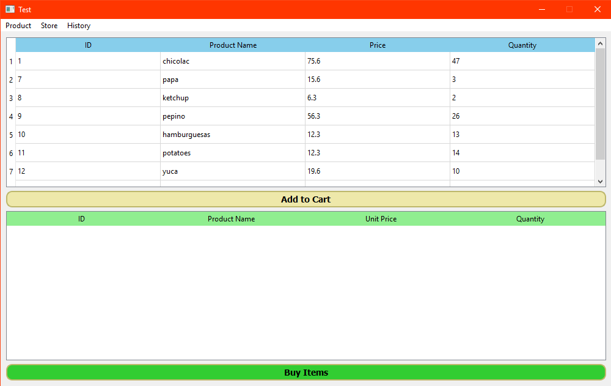

# DevFun-GB
# Shopping Cart
Dev Fundamentals Python -  Project Shopping Car

To execute the pryect need to install the requirements:

 pip install -r requirements.txt

Functions as:
Save Product

Edit Product

Delete Product
![alt text](src/images/delete_product.png

Shopping

Review Historial

# Members

 - Ariel Gonzales
 - Franz Vidangos
 - Kattya Espinoza
 - Vivian Zamorano

